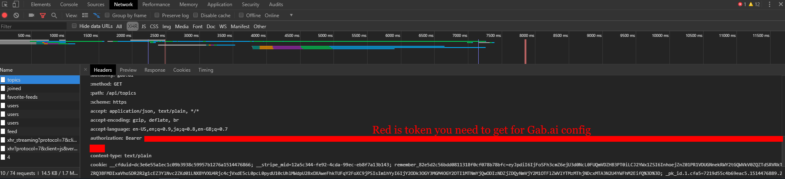

# Configuration

## Minds

Just provide your password and login
```toml
[minds]
username = "username"
password = "password"
```

## Gab

Currently requires you to use token

```toml
[gab]
token = "fill your token"
```

In order to get it you need to login in Gab.ai
and use developer console to retrieve it from `Authorization` header.
[](gab_dev_console.png)

## Twitter

Go to [app page](https://apps.twitter.com/) and create new app for yourself.

After that go to section `Keys and Access Tokens` to retrieve configuration:

`Application Settings` has `Consumer Key` and `Consumer Secret`
Put it in section below:

```toml
[twitter.consumer]
key = "key"
secret = "secret"
```

`Your Access Token` has `Access Token` and `Access Token Secret`
Put it in section below:

```toml
[twitter.access]
key = "token"
secret = "secret"
```
